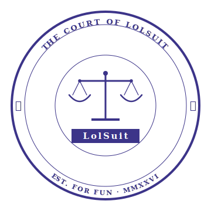
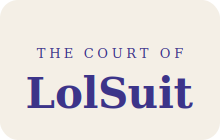

# ⚖️ LolSuit — אפיון מוצר ומותג

**גרסה 1.0** · מאי 2026 · מחליף את `suit-for-fun-spec.md` בכל הקשור למותג ומוצר
**פרויקט גמר:** Full-Stack Web Development · Intuit Israel @ RUNI · 2026
**Stack:** React + TypeScript + Material UI · Python + Flask · MySQL · JWT + bcrypt

> מסמך זה מתמקד ב**זהות המוצר, המותג, חוויית המשתמש ומערכת העיצוב**.
> פירוט טכני מלא של API, schema, מבנה תיקיות וכו' — נשאר ב-`suit-for-fun-spec.md` (יש לעדכן שם את שם המותג).

---

## 1. תקציר מנהלים (One-pager)

**LolSuit** הוא רשת חברתית של **תביעות מצחיקות בין חברים**. כל פוסט הוא "כתב אישום" רשמי על תסכול יומיומי — מהאחות שגנבה את המטען ועד השכן שמנגן את אותם 4 אקורדים של Wonderwall כל לילה ב-23:58. הקהילה היא **חבר המושבעים**, ומכריעה בלייקים: **חייב** או **זכאי**.

**הטון:** Legal Cosplay — פורמליות-משפטית-עד-כדי-גיחוך.
**השפה:** עברית (RTL), עם ניצוצות אנגלית בשם המותג ובמיקרו-קופי.
**הקהל:** בני 18-35, פעילים ברשתות חברתיות, אוהבים את אסתטיקת ה-deadpan humor של רדיט/טוויטר.

---

## 2. חזון (The Manifesto)

> "החיים מלאים בעוולות קטנות. רובן לא יגיעו לבית משפט, רובן לא ראויות לעורך דין יקר, וכמעט אף אחת מהן לא תזכה אותך בפיצויים אמיתיים.
> אבל זה לא אומר שהן לא מגיעות להן יום בבית המשפט. **LolSuit הוא בית המשפט הזה.**"

הרשתות החברתיות הקיימות נותנות לך לפרסם תסכול ("השכן שלי על הזין"). LolSuit נותן לזה **טקס**. כשהתסכול שלך הופך לכתב אישום פורמלי עם נתבע, עילות, ופיצוי מבוקש — הוא מצחיק יותר, נקרא יותר, ומקבל הצבעות במקום סתם לייקים אגביים.

זה לא Reddit. זה לא טוויטר. זה **טיקטוק של דיני נזיקין דמיוניים**.

---

## 3. זהות המותג

### 3.1 השם — למה LolSuit?

| בחינה | תוצאה |
|--------|--------|
| **קצר** | 7 תווים, אות אחת מ-"Lol" |
| **דו-לשוני** | "Lol" מוכר בעברית ובאנגלית, "Suit" = תביעה גם בעברית מקובל |
| **משחק מילים כפול** | תביעה + צחוק = LolSuit. כל אחד מבין מיד |
| **דומיין** | `lolsuit.com` תפוס · **המלצה: `lolsuit.lol`** (תביעה ב-.lol — מושלם) · חלופות פנויות: `.fun` `.io` `.app` |
| **טון** | Casual אבל לא ילדותי — מתאים גם להפצה בלינקדאין וגם בטיקטוק |

### 3.2 מערכת הלוגו

ארבעה נכסים, כל אחד למטרה אחרת. **חשוב להשתמש בכל אחד רק במקום שלו.**

#### א. החותמת הרשמית — `lolsuit-seal.svg`



**מתי להשתמש:** דפי קרדיט · About page · footer · email signatures · מסמכים רשמיים · screenshots לפורטפוליו · גרסה רשמית לשליחה למרצה.
**מתי לא להשתמש:** TopBar · favicon · אווטרים · כפתורים. גודל מינימלי 120px (פחות מזה — הטקסט בקשת לא קריא).

#### ב. הכרטיס המרכזי — `lolsuit-lockup-card.svg`



**מתי להשתמש:** Hero של דף הבית · כותרת של About · "באנר" באמצע דף · כרטיסי ביקור · OG preview של רשתות חברתיות.
**מתי לא להשתמש:** TopBar רגיל (גובהו 56-64px, הכרטיס 140px — גבוה מדי) · בתוך כפתורים.

#### ג. הלוקאפ האופקי (ל-TopBar) — `lolsuit-lockup-horizontal.svg`


**מתי להשתמש:** TopBar של האתר (זה המקום העיקרי) · footer מצומצם · breadcrumbs.
**מתי לא להשתמש:** מקום שבו אין מספיק רוחב (פחות מ-220px) — אז עוברים לאייקון בלבד.

#### ד. האייקון — `lolsuit-icon.svg`


**מתי להשתמש:** Favicon · אווטרים · אייקון App (אם תהיה אפליקציה בעתיד) · ה-`<head>` של ה-HTML (`<link rel="icon">`) · social share thumbnails.
**מתי לא להשתמש:** במקום שיש מקום ל-wordmark מלא — תמיד עדיף לוקאפ עם השם.

### 3.3 כללי שימוש (Do's and Don'ts)

| ✅ עשה | ❌ אל תעשה |
|--------|------------|
| תמיד שמור מרחב לבן סביב הלוגו (≥ גובה אות אחת) | אל תמתח את הלוגו לאופקי או אנכי — תמיד שמור פרופורציה |
| השתמש בסגול `#3C3489` או לבן (על רקע סגול) בלבד | אל תשים את הלוגו על תמונה צבעונית מבלי overlay |
| לרקעים כהים: השתמש בגרסה הלבנה של החותמת | אל תוסיף אפקטים — drop shadow, glow, gradient — שום דבר |
| לציטוטים: גרסת הכרטיס עם רקע הקרם `#F4EFE6` | אל תשנה את הסרט "LolSuit" בחותמת — זה חלק מהמותג |

### 3.4 פלטת הצבעים

| תפקיד | שם | HEX | שימוש |
|--------|-----|-----|--------|
| **Primary** | Court Purple | `#3C3489` | לוגו · CTA · accents · headlines |
| **Surface** | Parchment Cream | `#F4EFE6` | רקע כרטיס לוגו · highlights · banners |
| **Background** | Off-White | `#FAFAF7` | רקע ראשי של האתר |
| **Text Primary** | Ink Black | `#1A1530` | טקסט גוף · כותרות |
| **Text Secondary** | Slate Gray | `#5E5A6B` | טקסט משני · captions · timestamps |
| **Guilty (חייב)** | Verdict Red | `#B33A3A` | הצבעת "חייב" · badges של הרשעה |
| **Innocent (זכאי)** | Acquittal Green | `#4A7C59` | הצבעת "זכאי" · badges של זיכוי |
| **Hot Tag** | Brass Gold | `#D4A24C` | תג "🔥 חם" · highlight של תביעות פופולריות |
| **Border** | Soft Lilac | `#E5E1F0` | קווי הפרדה · גבולות כרטיסים |

> **שיקול נגישות:** כל הצבעים שנבחרו עוברים את הסף של WCAG AA על רקע off-white. אדום-ירוק לקלפיות — לא להסתמך רק על צבע, יש להוסיף לייבל טקסטואלי "חייב"/"זכאי" וקצת אייקון.

### 3.5 טיפוגרפיה

| תפקיד | פונט | משקלים | שימוש |
|--------|------|---------|--------|
| **Display / Headlines** | **Frank Ruhl Libre** | 700, 900 | כותרות גדולות · "כתב אישום" · כותרות תביעות · banner |
| **Body** | **Heebo** | 300, 400, 500 | טקסט גוף · UI elements · טפסים · כפתורים |
| **Brand / Logo** | Georgia (system) | 700 | רק בתוך הלוגו (לא להשתמש באתר עצמו) |
| **Mono / Code** | Menlo, Consolas | 400 | אם צריך קוד — אזורי אדמין/Debug |

**סקאלת גודל (rem-based, base 16px):**

| Token | Size | Use |
|-------|------|-----|
| `xs` | 0.75rem · 12px | timestamps · captions |
| `sm` | 0.875rem · 14px | תווית · badge · helper text |
| `base` | 1rem · 16px | body |
| `md` | 1.125rem · 18px | סאב-כותרת בתוך post |
| `lg` | 1.5rem · 24px | כותרת תביעה |
| `xl` | 2rem · 32px | h2 · banner |
| `2xl` | 3rem · 48px | h1 · hero |
| `3xl` | 4.5rem · 72px | landing page hero only |

### 3.6 Voice & Tone — איך כותבים ב-LolSuit

הטון הוא **שופט פורמלי שמתאמץ לא לצחוק**. כל מילה ב-UI לבושה בחליפה — אבל עם עניבה הפוכה.

**עקרונות:**

1. **טרמינולוגיה משפטית במקום טרמינולוגיה רגילה.** לא "פוסט" — **"כתב אישום"**. לא "התחבר" — **"התייצב"**. לא "התנתק" — **"שחרור באולם"**.
2. **תיאורים יבשים של דברים אבסורדיים.** "חבר מושבעים יקבע — חייב או זכאי" יותר מצחיק מ-"תצביעו עליי לול".
3. **שמרו על כבוד לבעלי הדין.** הטון הוא של בית משפט, לא של ויכוח באינטרנט. גם הנתבע מקבל כבוד (טכנית).
4. **עברית פורמלית, אנגלית רק בשם המותג.** אין "Hey, vote here!" — אם זה כפתור, זה אומר **"הצבע"** (לא "תצביע" או "להצביע").

**טבלת מונחים — להחליף בכל הקוד והעיצוב:**

| Tech term | LolSuit term | היכן |
|-----------|---------------|------|
| Login | **התייצבות** / **התייצב** | TopBar · כפתור · path `/login` (אבל הטקסט "התייצב") |
| Sign up | **רישום לרשימת התובעים** | Signup page |
| Logout | **שחרור באולם** | TopBar dropdown |
| Post | **כתב אישום** | UI label · email subjects |
| New Post | **הגש תביעה** | Button · path display |
| Author | **תובע** | בכרטיס · ב-Users page |
| Defendant | **נתבע** | בכרטיס |
| Like / Upvote | **הצבע "חייב"** | VoteBar |
| Dislike / Downvote | **הצבע "זכאי"** | VoteBar |
| Trending | **חם עכשיו** | טאב ב-Home |
| Latest | **חדש** | טאב ב-Home |
| Resolved | **הוכרע** | טאב ב-Home |
| Profile | **תיק** | Users → UserPosts |
| User | **מושבע** (אם רשום) / **תובע** (אם הגיש) | בהקשר |
| Comment (future) | **טיעון מקדים** / **תגובת מושבע** | v2 |

**דוגמאות למיקרו-קופי:**

| הקשר | טקסט |
|------|------|
| Loading | "טוען את התיקים..." |
| Empty state (Feed) | "אין תביעות פתוחות כרגע. הקהילה רגועה." |
| Empty state (User Posts) | "התובע טרם הגיש תביעות." |
| Error 404 | "התיק לא נמצא בארכיון." |
| Error 500 | "הפסקה באולם. נסה שוב בעוד רגע." |
| Logout confirmation | "האם לשחרר אותך באולם?" |
| Delete claim confirm | "האם למחוק את כתב האישום? פעולה זו בלתי הפיכה." |
| Form validation (חובה) | "שדה חובה — בית המשפט מתעקש." |

---

## 4. קהל יעד

### 4.1 פילוח כללי

| נתון | ערך |
|------|-----|
| גילים | 18-35 (לב הקהל), 16-50 (טווח רחב) |
| מגדר | מאוזן |
| גיאוגרפיה (v1) | ישראל בלבד |
| שפה (v1) | עברית בלבד |
| פלטפורמה ראשית | Web — Desktop ו-Mobile |
| מקור הגעה צפוי | Word of mouth · רשתות חברתיות · שיתוף קישורי תביעות בקבוצות וואטסאפ |
| צריכת זמן ממוצעת | 3-7 דקות לסשן · 2-3 סשנים בשבוע |

### 4.2 פרסונות (3 ארכיטיפים)

#### 🎓 פרסונה 1 — אלון, 22, סטודנט שנה ב'

- לומד מדעי המחשב בטכניון
- צרכן כבד של רדיט, טוויטר, ויקיפדיה
- מעריץ של humor יבש, אוהב Norm Macdonald, John Mulaney
- **למה הוא ב-LolSuit:** הוא ראה תביעה ויראלית בוואטסאפ של חבר ובא לראות עוד. הוא נשאר כי הוא יכול להגיש תביעה על השותף שאוכל את הגבינה שלו בלי לבקש.
- **הצורך שלו:** מקום שמעריך אסטטיקה ספציפית (deadpan + format רשמי) שרדיט הישראלי לא יודע לעשות.
- **התנהגות צפויה:** מגיש 2-3 תביעות בחודש. מצביע בכל סשן. נשאר בפיד 5-10 דקות.

#### 👩‍💼 פרסונה 2 — מאיה, 28, מנהלת קמפיינים דיגיטליים

- עובדת בחברת הייטק
- פעילה באינסטה ובטיקטוק
- מחפשת תוכן שאפשר לשתף בסטורי
- **למה היא ב-LolSuit:** היא ראתה screenshot של תביעה בטוויטר ("האקס שעוקב אחרי בכל פלטפורמה") וזה דיבר אליה ברמה אישית. בא לחפש את התביעה ולשתף.
- **הצורך שלה:** תוכן שאפשר לצרוך מהר, להזדהות, ולשתף.
- **התנהגות צפויה:** קוראת הרבה, מגיבה (מצביעה) מעט. מגישה 1-2 תביעות בכל הקיום שלה. **משתמשת בעיקר במובייל.**

#### 🧑‍🦰 פרסונה 3 — יואב, 34, מורה לתנ"ך בתיכון

- אבא לשני ילדים קטנים
- ציני, אוהב הומור משפטי-בריטי-ישן
- היה ראש מערך הומור בעלון של חיל האוויר ב-2008
- **למה הוא ב-LolSuit:** הוא חיפש פלטפורמה להוציא את המתחים של הוראה ותורנויות-לילה עם תינוקות.
- **הצורך שלו:** מקום שלוקח את ההומור שלו ברצינות — לא מתביישים מהאסתטיקה הפורמלית.
- **התנהגות צפויה:** **משתמש חזק**. מגיש 5-8 תביעות בחודש. תביעות שלו מקבלות הצבעות גבוהות. בונה מוניטין של "טוען מצליח". בודק את התיק שלו מדי יום.

> **הצורך המשותף לשלושתם:** מקום שמעריך פורמט מעל פשטות. שלושתם יכולים להגיע מ-Reddit, אבל נשארים אם LolSuit נותן להם משהו שאין שם — **טקס וטרמינולוגיה ייחודית**.

---

## 5. מנגנון המוצר — Legal Cosplay

הצלע המרכזית של המוצר אינה הפיצ'ר עצמו (פיד + הצבעות), אלא **השכבה הטרמינולוגית** שעוטפת אותו.

### 5.1 ארבעת הריטואלים

| ריטואל | פעולה טכנית | חוויית המשתמש |
|---------|--------------|----------------|
| **הגשת תביעה** | יצירת פוסט | טופס שדורש: כותרת · נתבע · עילות · נסיבות · פיצוי מבוקש · מיקום (אופציונלי) |
| **התייצבות** | Login | "כל מי שמתייצב באולם — נכנס לרשימת המושבעים" |
| **הצבעת מושבע** | Like / Vote | "חייב" (אדום) או "זכאי" (ירוק) — בחירה אחת לתביעה, ניתן לשנות |
| **שחרור באולם** | Logout | "הוא יכול לחזור בכל עת" — אין fees, אין ban |

### 5.2 למה זה עובד?

1. **טרמינולוגיה מייצרת ציפיות.** כשמשהו נקרא "כתב אישום" ולא "פוסט", הוא מקבל יותר מחשבה. ה-quality bar עולה ויראלית.
2. **הומור באמת-ובכאילו.** הפורמט רציני, התוכן אבסורדי. הפער הוא מקור הצחוק.
3. **קל לשתף.** "הגיש את החברה שלי לבית משפט וניצחתי בלייקים" — זה משפט שמסביר את עצמו.

---

## 6. ארכיטקטורת מידע

### 6.1 Sitemap

```
LolSuit/
│
├── /                        🏠 Home (Feed)              [Public]
├── /users                   📋 לוח התובעים              [Public]
├── /user-posts/:userId      📁 תיק תובע                [Public]
├── /about                   📖 הצהרת כוונות             [Public]
│
├── /login                   ⚖️ התייצבות                [Public]
├── /signup                  ✍️ רישום לרשימת התובעים    [Public]
│
└── /new-post                📝 הגש תביעה               [Protected]
```

### 6.2 טבלת ניווט

| Path | תווית בעברית | מי רואה? | מיקום ב-TopBar |
|------|---------------|---------|------------------|
| `/` | בית | כולם | תפריט ראשי |
| `/users` | תובעים | כולם | תפריט ראשי |
| `/about` | אודות | כולם | תפריט ראשי |
| `/login` | התייצב | רק מבקרים | כפתור ימני |
| `/signup` | הצטרף | רק מבקרים | קישור משני |
| `/new-post` | **הגש תביעה** | רק מחוברים | כפתור CTA צהוב |
| (logout) | שחרור באולם | רק מחוברים | dropdown של המשתמש |

---

## 7. אפיון דפים

### 7.1 Home / Feed (`/`)

> "בית המשפט פתוח. הצבעת המושבעים בעיצומה."

| אלמנט | פרטים |
|--------|--------|
| Hero (only for visitors not logged in) | כותרת + 2 שורות תיאור + CTA "הצטרף לרשימת התובעים" |
| Tabs | 3 טאבים: **חם עכשיו · חדש · הוכרע** — כל אחד מטעין רשימה אחרת |
| Feed | 10 כרטיסי `SinglePost` ראשוניים, "טען עוד" מוסיף 10 בכל לחיצה |
| Empty state | "אין תביעות פתוחות כרגע. הקהילה רגועה." |
| Loading | `CircularProgress` של MUI במרכז |
| Mobile breakpoint | מתחת ל-600px — הטאבים נשארים אופקיים אבל קומפקטיים |

**State:**
- `selectedTab: 'hot' | 'new' | 'closed'`
- `posts: Post[]`
- `offset: number` (ל-pagination)
- `loading: boolean`

### 7.2 About (`/about`) — דף הצהרת הכוונות

זה ה-**moment** של המותג. כאן הטון מבריק.

מבנה (משוחזר מהאתר הקיים, עם התאמת השם):

1. **Hero** — לוגו ה-**כרטיס** הגדול במרכז · כותרת "LolSuit · הרשת החברתית של תביעות מגוחכות" · 3 chips (פורמלי-עד-כדי-גיחוך · קהילתי · לא-משפטית-באמת)
2. **הצהרת כוונות** — הציטוט מהמניפסט (סעיף 2 כאן)
3. **איך זה עובד** — 4 סעיפים ממוספרים (סעיף 1: הגש תביעה · סעיף 2: חבר המושבעים · סעיף 3: הצבעה אחת לתיק · סעיף 4: בעלות ואחריות)
4. **מילון מונחים** — תיבות עם המונחים מסעיף 3.6 (התייצבות, שחרור באולם, וכו')
5. **הבהרה משפטית (חצי-רצינית)** — דיסקליימר משעשע על זה שהאתר לא באמת מחייב משפטית
6. **CTA** — "הירשם כתובע" (אם לא מחובר) או "לכל הפיד" (אם כן)
7. **Footer** — חותמת קטנה + "פרויקט גמר · Full-Stack @ RUNI · 2026"

### 7.3 Users (`/users`)

לוח כל התובעים הרשומים במערכת.

| אלמנט | פרטים |
|--------|--------|
| כותרת | "רשימת התובעים" |
| חיפוש | שדה אחד — חיפוש לפי שם או מייל · debounce 300ms |
| טבלה | עמודות: שם · # תביעות · % הרשעות · כפתור "ראה תיק" |
| Load more | טעינת 10 שורות בכל פעם |

### 7.4 UserPosts (`/user-posts/:userId`) — תיק תובע

| אלמנט | פרטים |
|--------|--------|
| Profile card | אווטר · שם · 3 סטטיסטיקות (סה"כ תביעות · הרשעות · % הצלחה) |
| Posts list | כל התביעות של אותו תובע, ב-`SinglePost` |
| בעלות | אם currentUser === userId → רואים כפתורי עריכה/מחיקה על כל תביעה |

### 7.5 Login / Signup / New Post

טפסי MUI סטנדרטיים. **הסגנון:**

- Login: כותרת "התייצבות" · 2 שדות (אימייל, סיסמה) · כפתור "התייצב"
- Signup: "רישום לרשימת התובעים" · 4 שדות · כפתור "הצטרף לרשימת המושבעים"
- NewPost: "הגשת תביעה" · 7 שדות (כותרת, נתבע, עילות חישובות בצ'יפים, נסיבות, מיקום, פיצוי, preview חי) · כפתור "הגש כתב אישום"

---

## 8. רכיבים מרכזיים (Component Library)

### 8.1 `<TopBar />` — **(שיניתי)**

הרכיב הראשי שמופיע בכל דף. **כאן הלוקאפ האופקי `lolsuit-lockup-horizontal.svg` נכנס לפעולה.**

**מבנה (מצב לא-מחובר):**
```
┌──────────────────────────────────────────────────────────┐
│  [Lockup Horizontal]      בית · תובעים · אודות    [התייצב] │
└──────────────────────────────────────────────────────────┘
```

**מבנה (מצב מחובר):**
```
┌──────────────────────────────────────────────────────────┐
│  [Lockup Horizontal]   [הגש תביעה ⚖]   שלום, אלון ▾    │
└──────────────────────────────────────────────────────────┘
```

המשתמש לוחץ על השם → מתפתח dropdown עם "התיק שלי" + "שחרור באולם".

**מאפיינים טכניים:**
- `position="sticky"`, top=0
- גובה: 64px (desktop) / 56px (mobile)
- רקע: `#FAFAF7` (off-white) עם border תחתון `1px solid #E5E1F0`
- צל קל ב-scroll (משתמשים ב-`useScrollTrigger` של MUI)

### 8.2 `<SinglePost />` — כרטיס תביעה

הרכיב הכי חשוב באפליקציה (מופיע 10+ פעמים בכל דף).

**מבנה ויזואלי:**

```
┌─────────────────────────────────────────────────────┐
│ [אווטר]  שם תובע · לפני X זמן              [🔥 חם]│
│                                                      │
│ כותרת התביעה (Frank Ruhl Libre, h3)                  │
│                                                      │
│ ⚖ תובע: X     נ׳     נתבע: Y                       │
│                                                      │
│ [בגידה חברתית] [הפרת שלוות נפש] [ייאוש מכוון]      │
│                                                      │
│ פירוט הנסיבות... (טקסט עד 3 שורות, "קרא עוד")        │
│                                                      │
│ 📍 מיקום: רחוב הירקון, ת"א                          │
│ 💰 פיצוי מבוקש: איסור עולמי על שירי Oasis             │
├─────────────────────────────────────────────────────┤
│  [██████████░] חייב 85% (512)   זכאי 15% (87) [░]   │
│                                                      │
│  [   חייב!   ]                       [   זכאי   ]    │
└─────────────────────────────────────────────────────┘
```

**State אופטימיסטי:** לחיצה על "חייב!" מעדכנת מיד את הספירה ב-UI לפני שהשרת מגיב.

### 8.3 `<VoteBar />`

הפס של הצבעות בתחתית כל פוסט. שני אזורים אדומים/ירוקים שגדלים פרופורציונית.

### 8.4 `<ProtectedRoute />`

עוטף route ב-`/new-post`. אם אין `token` ב-localStorage → redirect ל-`/login`.

### 8.5 רכיבים נוספים

- `<Hero />` — landing page top section
- `<CourtSealMark />` — קומפוננטה שמציגה את החותמת (גודל פרמטר)
- `<Glossary />` — תיבות המונחים בדף About
- `<EmptyState />` — לרשימות ריקות, עם איקון ומיקרו-קופי

---

## 9. Design System — Tokens

### 9.1 Spacing (8-point grid)

```css
--space-1: 0.25rem;  /* 4px */
--space-2: 0.5rem;   /* 8px */
--space-3: 0.75rem;  /* 12px */
--space-4: 1rem;     /* 16px */
--space-5: 1.5rem;   /* 24px */
--space-6: 2rem;     /* 32px */
--space-7: 3rem;     /* 48px */
--space-8: 4rem;     /* 64px */
```

### 9.2 Border Radius

```css
--radius-sm: 4px;    /* chips · small buttons */
--radius-md: 8px;    /* כפתורים · inputs */
--radius-lg: 12px;   /* כרטיסי תביעה */
--radius-xl: 18px;   /* card lockup · large panels */
--radius-pill: 999px;/* tags · status badges */
```

### 9.3 Shadows

עיקרון: שימוש מינימלי. רק כשצריך הפרדה.

```css
--shadow-sm: 0 1px 2px rgba(26, 21, 48, 0.06);     /* hover על כרטיס */
--shadow-md: 0 2px 8px rgba(26, 21, 48, 0.08);     /* TopBar בגלילה */
--shadow-lg: 0 8px 24px rgba(26, 21, 48, 0.12);    /* modals · dropdowns */
```

### 9.4 Breakpoints

```css
--bp-sm: 600px;   /* טאבלט portrait */
--bp-md: 900px;   /* טאבלט landscape · laptop קטן */
--bp-lg: 1200px;  /* desktop רגיל */
--bp-xl: 1536px;  /* desktop רחב */
```

---

## 10. Tech Stack — תקציר

הרחבה מלאה ב-`suit-for-fun-spec.md` (סעיפים 3-4). תקציר:

| שכבה | טכנולוגיה |
|------|------------|
| Frontend | React 18 + TypeScript + Vite |
| UI | Material UI v5 (RTL theme) |
| Routing | react-router-dom v6 (HashRouter ל-GitHub Pages) |
| Backend | Python 3.11 + Flask |
| DB | MySQL 8 |
| Auth | PyJWT + bcrypt |
| Hosting (frontend) | GitHub Pages |
| Hosting (backend, future) | TBD (Render/Railway/Heroku) |

**עדכוני MUI Theme שצריך לעשות:**

```ts
// client/src/theme.ts
import { createTheme } from '@mui/material/styles';
import { heIL } from '@mui/material/locale';

export const lolsuitTheme = createTheme({
  direction: 'rtl',
  palette: {
    primary: { main: '#3C3489' },
    secondary: { main: '#D4A24C' },
    error:   { main: '#B33A3A' },     // ל-"חייב"
    success: { main: '#4A7C59' },     // ל-"זכאי"
    background: { default: '#FAFAF7', paper: '#FFFFFF' },
    text: { primary: '#1A1530', secondary: '#5E5A6B' },
  },
  typography: {
    fontFamily: '"Heebo", "Helvetica", sans-serif',
    h1: { fontFamily: '"Frank Ruhl Libre", serif', fontWeight: 900 },
    h2: { fontFamily: '"Frank Ruhl Libre", serif', fontWeight: 700 },
    h3: { fontFamily: '"Frank Ruhl Libre", serif', fontWeight: 700 },
  },
  shape: { borderRadius: 12 },
}, heIL);
```

---

## 11. Data Model — תקציר

הרחבה ב-`suit-for-fun-spec.md` (סעיף 9). תקציר:

- `users(id, name, email, password_hash, created_at)`
- `posts(id, title, body, defendant, location, charges (JSON), damages, author_id, guilty_votes, innocent_votes, created_at)`
- `votes(id, post_id, user_id, side ENUM('guilty','innocent'), UNIQUE(post_id, user_id))` — בונוס

**אין שינוי schema** בעקבות הרברנדינג. רק במחרוזות UI.

---

## 12. רוד-מאפ

### v1 (Current scope — חובה לפרויקט גמר)

- ✅ Frontend עם 7 routes
- ✅ Backend Flask עם CRUD posts + auth
- ✅ MySQL schema
- ✅ JWT auth מקצה-לקצה
- ✅ Rebrand מ-Suit for Fun ל-LolSuit (find & replace)
- ✅ ארבעת נכסי המותג מותקנים (Seal, Card, Horizontal, Icon)

### v1.5 — Polish (אם יש זמן לפני הגשה)

- Animations עדינים בטאבים ובהצבעות (framer-motion)
- Open Graph tags עם הכרטיס כתמונה (לשיתוף ויראלי)
- 404 / 500 דפי שגיאה ייעודיים עם הטון של המותג

### v2 — אחרי הקורס

- מערכת הצבעות מלאה (טבלת `votes`)
- תגובות = "טיעון מקדים של מושבע"
- "ערעור" — תביעה שמתייחסת לתביעה קיימת
- התראות
- שיתוף לרשתות (Twitter, WhatsApp, Instagram Stories)
- Mobile app (React Native)

### v3 — חלום רחוק

- אנגלית כשפה משנית
- Premium tier — "Esquire" (badge, ללא פרסומות, גרסה מורחבת של תיק)
- שיתופי פעולה עם משפיענים-קומיקאים שירשת לעצמם תיק

---

## 13. מילון מונחים — Legal-Mock Glossary

| מונח | משמעות במציאות | משמעות ב-LolSuit |
|------|------------------|--------------------|
| **התייצבות** | להופיע בבית משפט | Login |
| **שחרור באולם** | אישור שופט לעזוב | Logout |
| **כתב אישום** | מסמך פתיחת תיק פלילי | Post (תביעה) |
| **תובע** | מי שמגיש תביעה | User שיצר Post |
| **נתבע** | מי שתובעים אותו | שם הנתבע ב-Post (טקסט חופשי) |
| **חבר המושבעים** | פאנל אזרחים שמחליטים אשם/חף | קהילת LolSuit (כל המשתמשים) |
| **מושבע** | חבר אחד בחבר המושבעים | User רשום |
| **חייב** | פסק דין מרשיע | הצבעה אדומה |
| **זכאי** | פסק דין מזכה | הצבעה ירוקה |
| **תיק** | תיק התביעה הספציפי | פרופיל משתמש (UserPosts) |
| **הוכרע** | פסק דין סופי | תביעה עם 70%+ הצבעות בצד אחד |
| **עילה** | בסיס משפטי לתביעה | Tag/chip בתביעה (בגידה חברתית, רשלנות פלילית וכו') |
| **פיצוי מבוקש** | סכום פיצוי | טקסט חופשי (לרוב לא-כספי, לרוב מצחיק) |

---

## 14. הבהרה משפטית (חצי-רצינית)

LolSuit היא בדיחה. שום תביעה כאן לא מחייבת אף אחד משפטית. אם הכלב שלך מסרב לזוז מהספה, אנחנו ממליצים על ביסקוויט, לא על עורך דין. שמות הנתבעים הם המצאה ספרותית — אל תזהה אנשים אמיתיים, ואל תזהיר את השכן שלי שאני בדרך לתבוע אותו על "Wonderwall".

---

## 15. רשימת פעולות הבאות (Implementation Checklist)

**מהקוד הקיים → ל-LolSuit:**

- [ ] **Find & Replace גלובלי:** `Suit for Fun` → `LolSuit` בכל הקבצים
- [ ] **Favicon:** החלף את ה-emoji ⚖️ ב-`lolsuit-icon.svg`
- [ ] **TopBar:** החלף את ה-GavelIcon של MUI ב-`lolsuit-lockup-horizontal.svg` (כקובץ React component או ``)
- [ ] **About page:** הוסף את חותמת `lolsuit-seal.svg` ב-footer של הדף
- [ ] **Hero / Landing:** השתמש ב-`lolsuit-lockup-card.svg` כאלמנט הראשי
- [ ] **`theme.ts`:** עדכן לפלטה החדשה (`#3C3489` במקום הצבע הנוכחי)
- [ ] **OG Tags ב-`index.html`:** הוסף `<meta property="og:image">` שמצביע ל-PNG export של הכרטיס
- [ ] **README:** עדכן עם השם החדש, screenshot של הכרטיס, ולינק לאפיון הזה
- [ ] **`package.json`:** עדכן `name` ו-`description`

---

*מסמך חי — מתעדכן בכל sprint · גרסה 1.0 · מאי 2026*
*נכתב על ידי אבי לזרוביץ׳ + Claude · פרויקט גמר Full-Stack @ RUNI*
